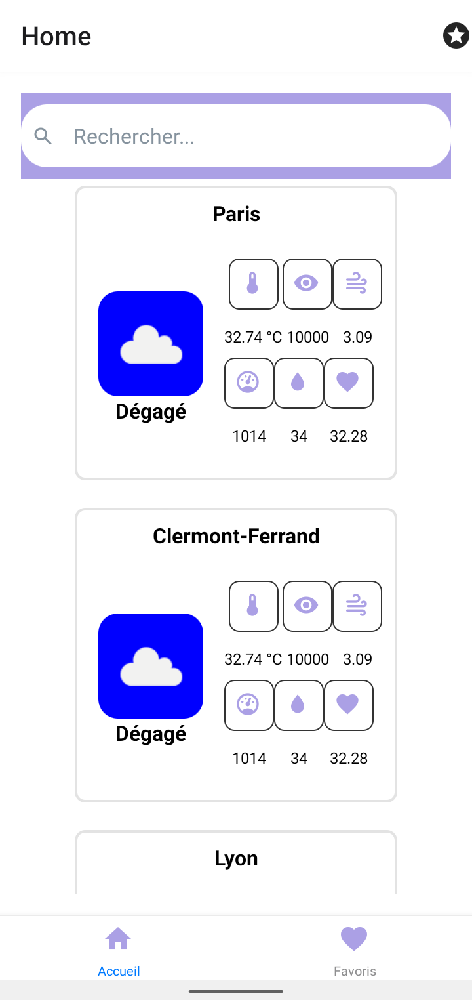
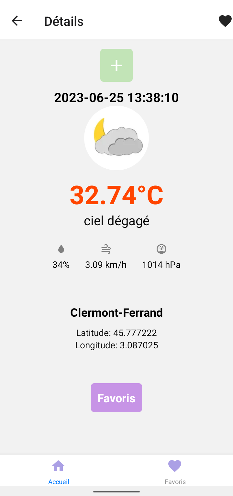
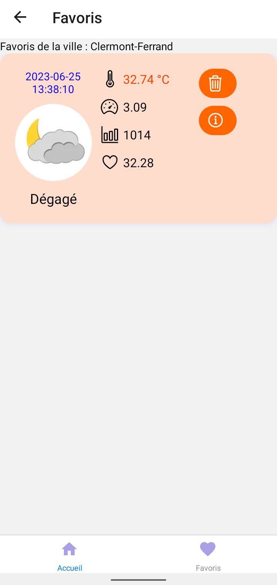
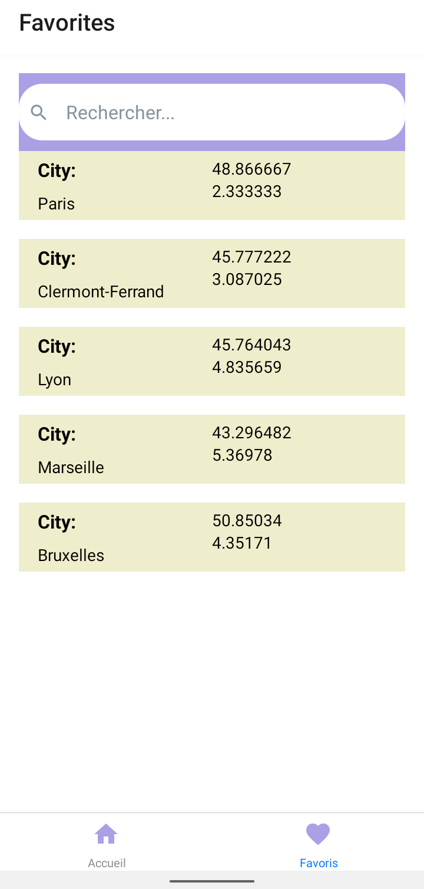

[](https://codefirst.iut.uca.fr/augustin.affognon/MeteoApp)

# Projet
<h2>Application native de météo </h2>

* Les données méologiques recupérées via une api <a href="https://iut-weather-api.azurewebsites.net/swagger-ui/"> WEATHER API</a>

* La persistance avec <b>AsyncStorage</b>

## MeteoApp Sketch
  Accueil                 |   Page Detail                
:-------------------------:|:-------------------------:
   |  


## MeteoApp Screenshots
  Accueil                 |   Page Detail      |  Page Favoris                 | Liste Favoris                
:-------------------------:|:-------------------------:|:-------------------------:|:-------------------------:
   |  |   |   
 
### Installation

```
$ npm install
```

### Local Development

```
$ npm start
```

## Author : 

* <a >Augustin AFFOGNON</a>